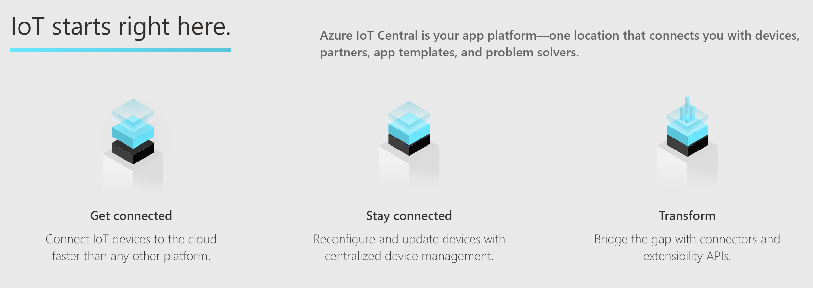

# Azure IoT Central Hands-on Lab

---

## What is IoT Central

IoT Central is an IoT application platform that reduces the burden and cost of developing, managing, and maintaining enterprise-grade IoT solutions. Choosing to build with IoT Central gives you the opportunity to focus time, money, and energy on transforming your business with IoT data, rather than just maintaining and updating a complex and continually evolving IoT infrastructure.

You can read more about Azure IoT Central [here](https://docs.microsoft.com/en-us/azure/iot-central/core/overview-iot-central?WT.mc_id=github-blog-dglover)  

Watch Azure IoT Central updates video [here](https://azure.microsoft.com/en-us/resources/videos/iot-central-updates?WT.mc_id=github-blog-dglover)

---

## Step 1: Create an Azure IoT Central application

[Tutorial](https://docs.microsoft.com/en-us/azure/iot-central/core/quick-deploy-iot-central?WT.mc_id=github-blog-dglover)

---

## Step 2: Add a simulated device to your IoT Central application

---

[Tutorial](https://docs.microsoft.com/en-us/azure/iot-central/core/quick-create-pnp-device?WT.mc_id=github-blog-dglover)

---

## Step 3 : Configure Rules and actions for your device in your IoT Central application

[Tutorial](https://docs.microsoft.com/en-us/azure/iot-central/core/quick-configure-rules?WT.mc_id=github-blog-dglover)

---

## Step 4 : Connect an MXChip IoT DevKit device to your Azure IoT Central application 

[Tutorial](https://docs.microsoft.com/en-us/azure/iot-central/core/howto-connect-devkit?WT.mc_id=github-blog-dglover)

---

## Step 5 – (Bonus ) Create an application using Industry application templates

Now use an IoT Central Industry template to create your application, familiarize with the capabilities and further customize!

Choose one of the Industries according to your Industry domain or of interest to explore.

### Retail
	
Build an IoT Central application with one of the templates under [Retail](https://apps.azureiotcentral.com/build/retail). 

[Tutorial](https://docs.microsoft.com/en-us/azure/iot-central/retail/overview-iot-central-retail-pnp?WT.mc_id=github-blog-dglover)

### Energy

Build an IoT Central application with one of the templates under [Energy](https://apps.azureiotcentral.com/build/energy)

[Tutorial](https://docs.microsoft.com/en-us/azure/iot-central/energy/overview-iot-central-energy?WT.mc_id=github-blog-dglover)

### Government

Build an IoT Central application with one of the templates under [Government](https://apps.azureiotcentral.com/build/government)

[Tutorial](https://docs.microsoft.com/en-us/azure/iot-central/government/overview-iot-central-government?WT.mc_id=github-blog-dglover)

### Healthcare

Build an IoT Central application with one of the templates under [Government](https://apps.azureiotcentral.com/build/healthcare)

[Tutorial](https://docs.microsoft.com/en-us/azure/iot-central/healthcare/overview-iot-central-healthcare?WT.mc_id=github-blog-dglover)
